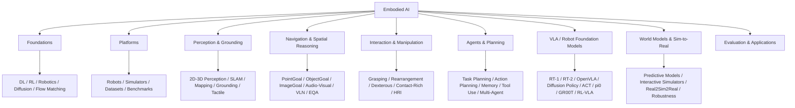

# Embodied AI Atlas

This is the top-level map for the vault. The architecture is organized by research objects and capabilities, not by source repository, so new awesome-list updates can be absorbed without changing the top-level structure.

## Area Maps

- [[10_Areas/Foundations|Foundations]]
- [[10_Areas/Platforms Robots Simulators Datasets|Platforms, Robots, Simulators, Datasets]]
- [[10_Areas/Perception and Grounding|Perception and Grounding]]
- [[10_Areas/Navigation and Embodied Vision|Navigation and Embodied Vision]]
- [[10_Areas/Interaction Manipulation Tactile|Interaction, Manipulation, Tactile]]
- [[10_Areas/Agents Planning and Memory|Agents, Planning, Memory]]
- [[10_Areas/VLA Robot Foundation Models|VLA / Robot Foundation Models]]
- [[10_Areas/World Models Sim2Real Evaluation|World Models, Sim-to-Real, Evaluation]]

## Resource Hubs

- [[40_Resources/Datasets|Datasets]]
- [[40_Resources/Simulators|Simulators]]
- [[40_Resources/Benchmarks|Benchmarks]]
- [[40_Resources/Codebases|Codebases]]
- [[40_Resources/Hardware and Sensors|Hardware and Sensors]]
- [[90_Sources/Resource Registry|Resource Registry]]

## Current Core Reading

- [[30_Literature_Notes/Aligning Cyber Space with Physical World — Embodied AI Survey|Aligning Cyber Space with Physical World: A Comprehensive Survey on Embodied AI]]

## Repository Roles

- HCPLab-SYSU anchors the backbone taxonomy.
- zchoi tracks frontier robotics-and-agent work.
- MilkClouds is treated as the VLA study roadmap.
- ChanganVR feeds embodied vision and navigation.
- Awesome-Touch feeds tactile sensing, contact-rich manipulation, tactile software, products, and labs.

## Invariant

Add new resources by extending fields in [[00_MOC/Knowledge Graph Schema|Knowledge Graph Schema]] and rows in [[90_Sources/Resource Registry|Resource Registry]]. Do not add a new top-level area unless the resource cannot be expressed as a combination of `area`, `task`, `method`, `modality`, and `embodiment`.
